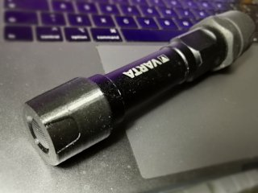
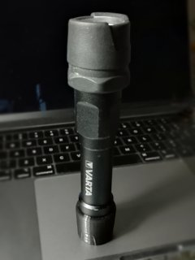
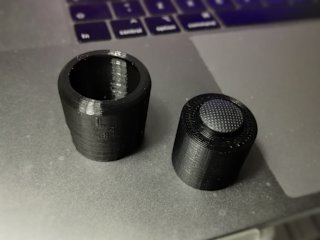
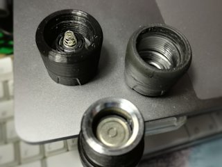
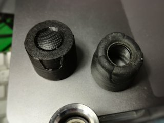
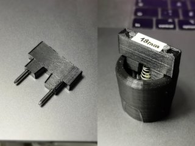
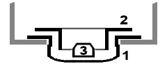

# Varta 1W/3W LED flashlight replacement switch cap
*3D printable repair or replacement switch end cap for the Varta “indestructible” flashlight*

### License
[Creative Commons - Attribution](https://creativecommons.org/licenses/by/4.0/)

### Attribution
This uses a model generated with the [Customizable Screw Cap by DrLex0](https://github.com/DrLex0/print3d-customizable-screw-cap), which is based on the `screw_extrude` function from “customizable round box with threaded lid” by FaberUnserzeit a.k.a. Philipp Klostermann ([Thingiverse thing:1648580](https://www.thingiverse.com/thing:1648580)).

### Gallery

[🔎](images/varta1.jpg) [🔎](images/varta2.jpg) [🔎](images/varta3.jpg) [🔎](images/varta4.jpg) [🔎](images/varta5.jpg)

## Description and Instructions

This is a replacement end cap for the Varta 1W LED flashlight and is likely to also fit the newer 3W version. This flashlight is marketed as being “indestructible” but I can assure you it can be destroyed, which is why I needed to replace the end cap.

I have also always found the design of the rear end to be annoying because it barely allows to position the flashlight upright even on a perfectly flat surface. Looking at photos from the newer 3W version, they further messed this up and it is even harder or impossible to put that one on a flat floor pointing upwards. This replacement cap fixes that problem by making the flashlight much more stable in this position, so this could be another reason to print this even if your flashlight is still in good condition.

This replacement re-uses the switch, rubber switch cover, and the spacer and little ‘pill’ of the original switch, so if you destroyed your flashlight to such degree that those parts are missing or broken, you're out of luck.

It is unlikely the end result will be perfectly watertight, unless you add some silicone kit in strategic places while assembling. It should however be more than splash-proof.

### Disassembling the existing cap

[🔎](images/tool.jpg)

Step 1 is to unscrew the switch from the original cap. This requires a tool with two prongs 18 mm apart. You can print the `disassembly-tool` and complete it by hammering two nails into the holes. The nails should be about 30 mm long and about 2 mm in diameter. I sanded off the sharp tips. Insert the prongs into the holes and turn counter-clockwise. Considerable force may be required to unscrew the switch, because it is attached with a kind of silicone kit. If it won't move, you could simply demolish the outer rubber and plastic to liberate it, but take care not to damage the rubber switch cover.

### Printing

Just like the original, this consists of two parts, a hard inner cap and a soft outer shell. For the `inner-cap.stl`, anything could do, but PETG is a good choice due to its toughness. Print this at 0.1 mm layer height to get an accurate screw thread. Needless to say that your printer must be well-calibrated to get an accurate thread.

For the outside part, a soft TPU is the ideal material. I used black NinjaFlex and printed it at 0.2 mm layers. You could print with low infill to make the thing softer, but there aren't many opportunities for hollow spaces anyway.

You can print both parts separately and then assemble them, or if your printer allows it, print everything as one multi-material print. In the first case, print the `rubber-separate.stl` part, otherwise use the `rubber-dualMaterial.stl` file. (The difference between these files is small, but you would have trouble with overhangs when printing the dual file as separate part, and trying to print supports with TPU is to be avoided).

### Assembling

If you have printed separate parts, it is easiest to start with assembling the switch inside the cup, and only then add the rubber shell, as shown in the gallery photos.

Most of the dimensions are quite forgiving, but ideally the hole for the rubber switch protector should have a diameter of 13.15 mm. If it is much wider, you might consider printing a new copy after checking the reason for the inaccuracy. If it is much narrower, you could try reaming the hole.

Insert the rubber switch cover (‘1’ in the image) in the cap. Easiest is to push it in using something not too sharp, for instance the end of a ballpoint pen with retracted point. Then insert the ring salvaged from the original assembly (‘2’ in the image). Finally, add the little ‘pill’ with its beveled end pointing up (‘3’ in the image). Most likely, the ring will not want to stay put and pop out of the rubber cover. This is not a problem as long as you keep it well-centered and ensure not to bump or tilt the assembly, such that everything remains aligned during the next step.

Next, screw in the switch using the same tool as you used to remove it from the original cap. There is no need to use silicone kit or glue unless your print was really sloppy. If it looks like the ring is no longer aligned when reaching the end, stop, unscrew, and align it again instead of trying to force it, because that was most likely the exact way in which I destroyed the original.

Even without the rubber (TPU) outer part, the cap should already screw onto the flashlight and everything should work. If it does, adding the TPU outer shell should only be a matter of wrapping it around the cap, which will be easy thanks to the elasticity of the TPU. In theory you could glue these parts together, for instance using neutral silicone kit, but I have found this to be unnecessary. The TPU provides enough grip and the fact that the parts can slip, reduces the risk of over-tightening the cap.

## Extras

The parameters that I have used to generate the cap with the [Customizable Screw Cap](https://github.com/DrLex0/print3d-customizable-screw-cap) maker are included in the file `CustomizableScrewCap.json`.
